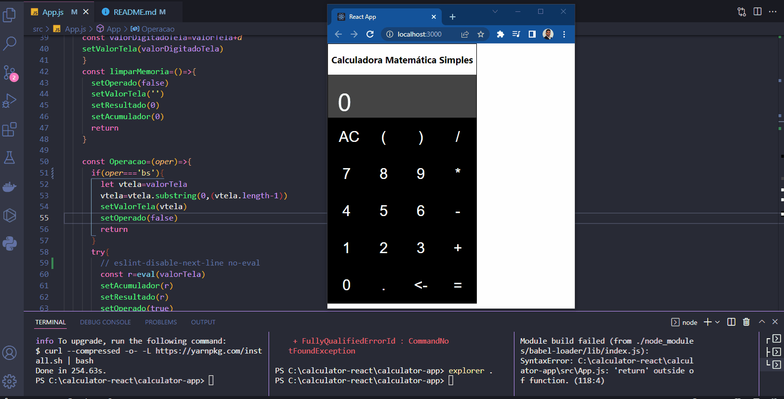

<h1 align="center">
  
   
  Calculator React-JS
</h1>

<h3 align="justify">
Application with calculator with ReactJS.
</h3>
 

## 📷 Demonstration

<h4 align="left"></h4>
  

 

## 🚀 Technologies

This project was developed with the following technologies:

- [ReactJS](https://reactjs.org/)

 

## ⚙ Commands Running
- yarn
- yarn start

Made with 💜 by Rafael Maciel